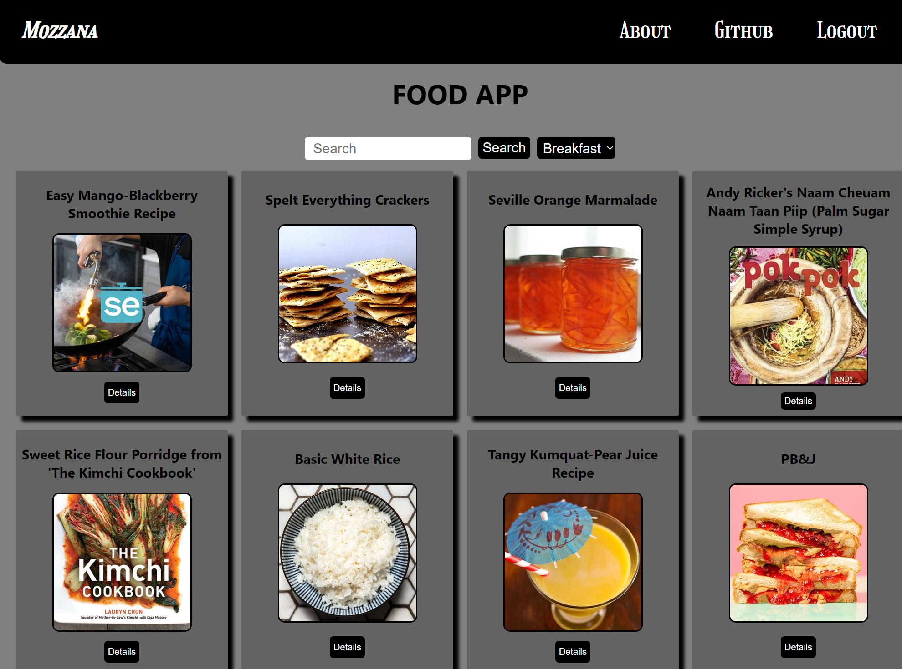

## Login Information
- **Username:** test
- **Password:** test

[Live Demo](https://todo-app-ts01.netlify.app/)
## Screenshots


# Recipe Demo

## Overview
Recipe Demo is a React-based web application designed to help users find and explore different recipes based on their preferences. The app fetches data from the Edamam API to provide a wide range of meal options.

## Features
- User authentication with local storage.
- Search for recipes by ingredients or meal type.
- Responsive and modern UI with styled-components.
- Navigation using React Router.
- API integration with Edamam.

## Technologies Used
- React 19
- React Router DOM 7
- Axios
- Styled-components
- React Icons

## Installation
1. Clone the repository:
   ```bash
   git clone https://github.com/yourusername/recipe-demo.git
   ```
2. Navigate to the project directory:
   ```bash
   cd recipe-demo
   ```
3. Install dependencies:
   ```bash
   npm install
   ```

## Usage
- Start the development server:
  ```bash
  npm start
  ```
- The app will be available at `http://localhost:3000/`.

## Scripts
- `npm start`: Runs the app in development mode.
- `npm build`: Builds the app for production.
- `npm test`: Runs tests.

## API Configuration
To use the Edamam API, replace the `APP_ID` and `APP_KEY` in `RecipeProvider.js` with your credentials.

## License
This project is open-source under the MIT License.

## Contact
For questions or collaboration, visit my [GitHub](https://github.com/recep-demir).

